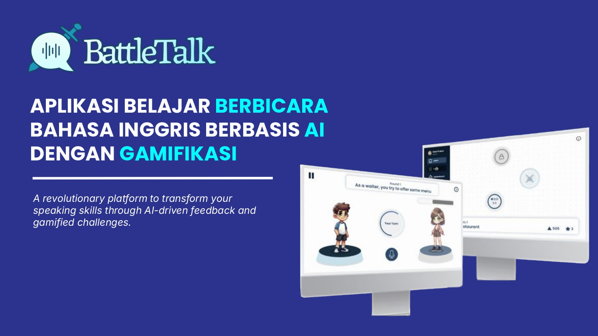
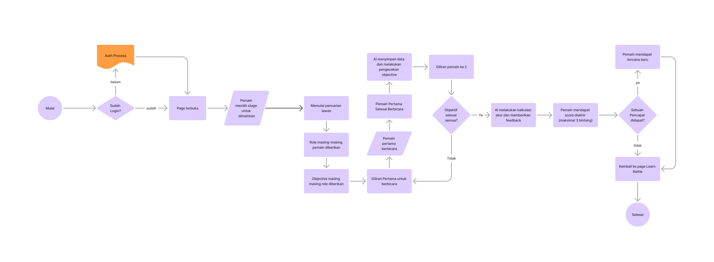

# 🗣️ BattleTalk: Aplikasi Belajar Berbicara Bahasa Inggris Berbasis AI dengan Gamifikasi



---

## 🔗 Project Links

- 🎥 [Demo Video](https://drive.google.com/file/d/1Nldca39k8mWHlWDOW5gYgnPas-R1kvZj/view?usp=sharing)  
- 📊 [Pitch Deck](https://drive.google.com/file/d/1b1yyd1kM_BUWfK-QydBQlpWZGoDG7NW1/view?usp=drive_link)  
- 💻 [Repository](https://github.com/ValentinoTriadi/find-it-aicecream/)  

---

## 📌 Overview

**BattleTalk** adalah platform belajar Bahasa Inggris berbasis gamifikasi yang fokus pada peningkatan kemampuan berbicara. Dengan fitur interaktif dan penilaian real-time, BattleTalk mendorong pengguna untuk aktif berbicara dalam skenario kehidupan nyata.

### 🎯 Fitur Utama:
- **Battle Mode**: Latihan speaking 1v1 dalam skenario nyata
- **Learn**: Video pembelajaran dan kuis berdasarkan topik
- **AI Feedback**: Penilaian otomatis untuk grammar, pronunciation, dan fluency
- **Leaderboard & Achievement**: Sistem kompetisi untuk motivasi belajar

---

## 🛠️ Technologies Used

- React + Vite + TypeScript
- TailwindCSS, MUI, Emotion
- Redux Toolkit, React Router DOM
- Node.js, FastAPI, Qwen2.5
- Supabase (Auth & Database)

---

### 🔄 User Flow
---



> Diagram alur pengguna BattleTalk mencakup:
> - Proses autentikasi
> - Pemilihan stage
> - Pencarian lawan dan giliran berbicara
> - Penilaian oleh AI dan pemberian feedback
> - Sistem skor dan pencapaian

---

## 🚀 Getting Started

Install dependencies and start development server:

```bash
pnpm i
pnpm dev
```

---

## 👥 Team Members

| Nama               | Email                          |
| ------------------ | ------------------------------ |
| Mohamad Maulana Firdaus Ramadhan           | 18222140@std.stei.itb.ac.id                       |
| Valentino Chryslie Triadi          | 13522164@std.stei.itb.ac.id                        |
| Muhammad Davis Adhipramana          | 13522157@std.stei.itb.ac.id                        |

---

## 📄 License & Credits

📝 Developed as part of **FindIT 2025** competition. All rights reserved by **AIce Cream** © 2025.

---

